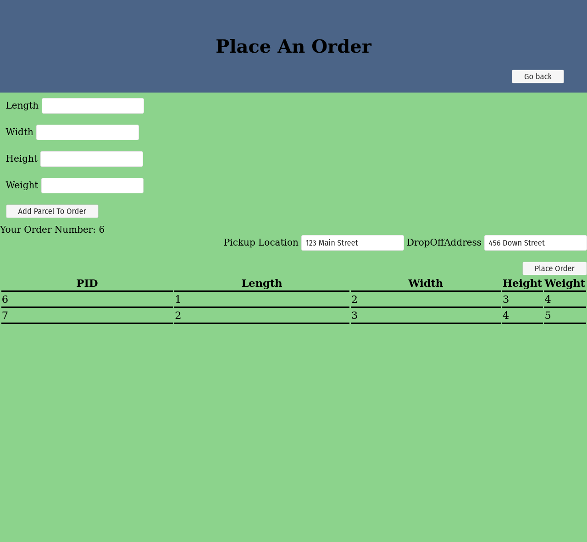

# CityPost

Start website on main.html

Simple project using HTML/CSS and PHP and MySQL to model a courier service. 

There are 3 different type of users: customers, courier and  managers.

Customer viewing their placed orders

Customers can place orders

Courier checking out the weekly schedule

Manager landing page

Manager deleting a route

# Features
- Different landing pages for different types of users
- Making customer account
- Ability to change account password
- Can place an order with multiple items 
- Setting and deleting courier routes
- Dynamically generated drop down menus
- Finding employees scheduled in every schedule
- Viewing placed orders
- And many more!